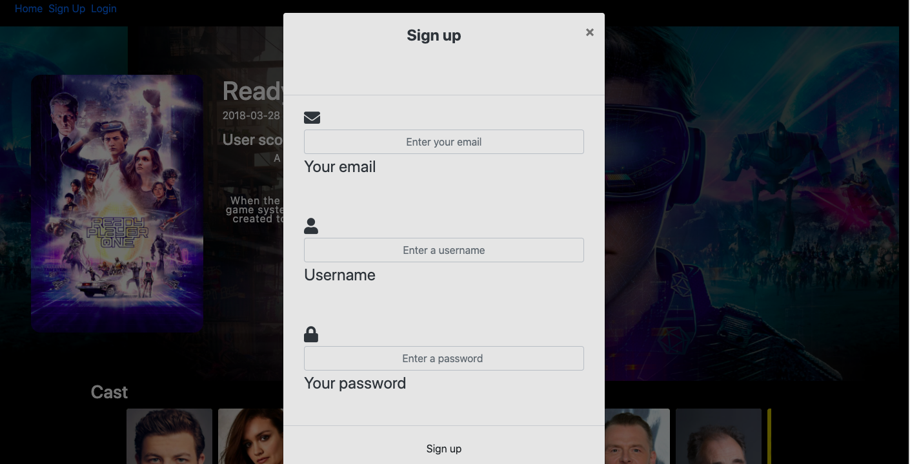
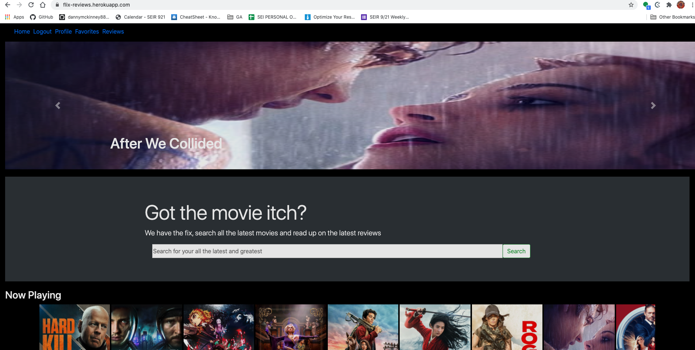
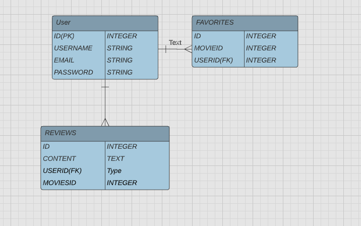
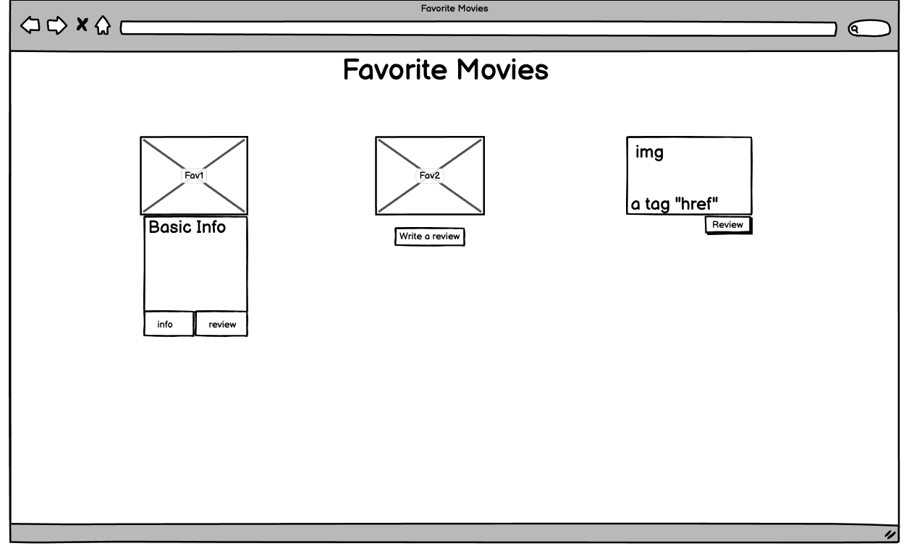
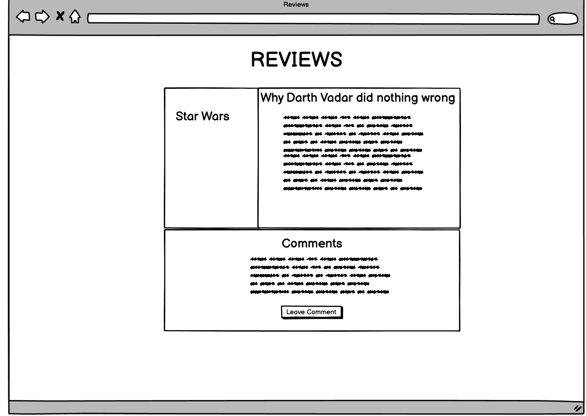
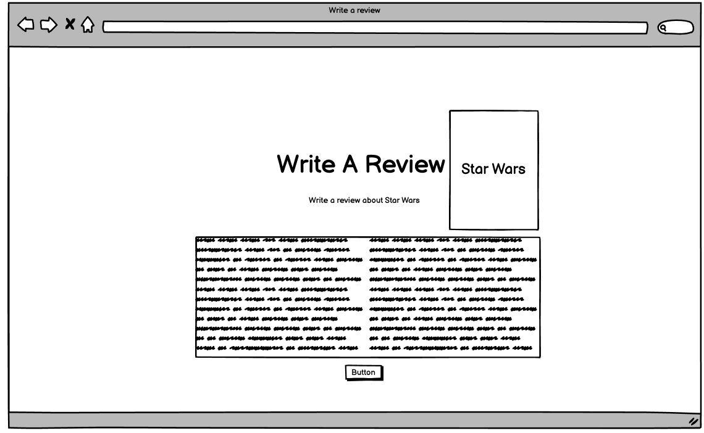

#  Flix Reviews
So here is Flix Reviews a colab school project. We have a site you can search for all movies old or new and not even out yet. Then get back information about the movies you want. Maybe just leave a review or add a movie to your favorite. Did you catch that last trailer for that upcomming blockbuster? If not we got have you covered the latest trailers inside.

## Why a movie site
Why not? No in all honesty it was just a project that sounded fun to do and we really wanted to use **TMDB API**. It also was a project that i belived in the 6 days we had to get a full **CRUD** app done that this project would fit perfect into that that time frame.

## User Stories 
The user will first be brought to the home page where they will see some movies displayed and the nav.

 -A user can browse movies and watch trailers not logged in

- A user can sign up for an account or log into an existing account

- A signed user will get the same home page with a welcome back message 

- A signed in user when on the info page of a movie will have two options 
- A signed in user can add a movie to a their favorites list 
- A signed in user can write a review about any movie they like 

## Technologies used 
* Javascript | Node | Express
* HTML
* CSS |Bootstrap
* PSQL| Sequelize | Heroku 

